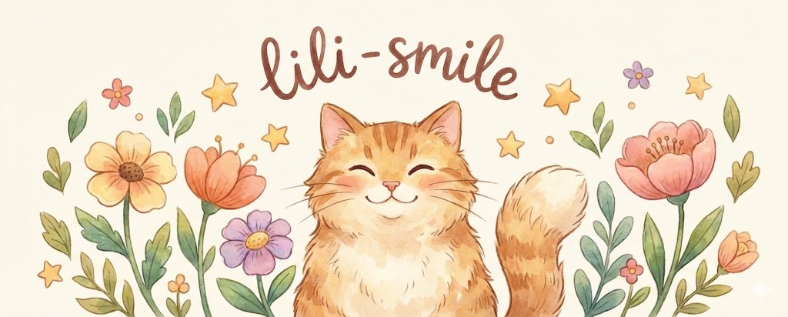

<video src="assets/lili.mp4" controls loop muted playsinline width="100%"></video>

  
  <h1>嗨，我是 Lili 👋</h1>
  
<strong>华南农业大学 博士在读</strong> | PhD Student @ South China Agricultural University (SCAU)

  
研究方向: 深度学习 / 视觉模型 / 动物科学  Research: deeplearn/ computervison/ animal science

  

    <a href="mailto:your_email@example.com">Email</a> ·
    <a href="https://scholar.google.com/">Google Scholar</a> ·
    <a href="https://orcid.org/">ORCID</a> ·
    <a href="https://www.researchgate.net/">ResearchGate</a>
  

---

## About Me | 关于我
- 🎓 博士在读，热爱科研与分享
- 🌱 关注 [智能投喂]，探索 [计算机视觉]
- 🧪 目前在做 [智能投喂和计算机视觉]
- 🐱 喜欢猫咪和花花，也喜欢把科研做成有温度的故事

## Research | 研究方向
- [方向 1]：智能投喂理论研究与工程实践

## Projects & Publications | 项目与成果
- [项目/论文 A](https://example.com) — 一句话简介
- [项目/论文 B](https://example.com) — 一句话简介
- [项目/论文 C](https://example.com) — 一句话简介

## Tech Stack | 技术栈

## Now | 近期
- ✅ 目标 1：完成 [阶段性成果]
- ✅ 目标 2：推进 [合作/实验]
- ✅ 目标 3：学习 [新方法/工具]

## Contact | 联系
- Email: your_email@example.com
- Google Scholar: https://scholar.google.com/
- ORCID: https://orcid.org/
- ResearchGate: https://www.researchgate.net/

## Dopamine Garden | 多巴胺小花园
- 🌸 花开即好消息
- 🐾 猫咪带来好运
- ✨ 学术与生活都要闪闪发光

<!-- TODO: 把方括号内容和链接替换成你的真实信息 -->

